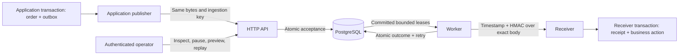

# Architecture and durability boundaries

One Go module builds the HTTP API and worker. PostgreSQL stores delivery intent,
leases, retry schedules, endpoint configuration, encrypted signing secrets,
ingestion receipts, audit, and cumulative accounting. The synthetic receiver,
load generator, and offline administrator support development and operations.

The application and receiver own their business transactions. The order example
uses separate schemas on the local PostgreSQL instance to demonstrate the
boundaries; those schemas are not delivery migrations.

## Acceptance and dispatch

The API reserves a scoped ingestion key, inserts the exact payload bytes, and
creates the first attempt in one transaction. An identical keyed retry returns
the original receipt; conflicting bytes or metadata return 409. HTTP 202 means
acceptance is durable, not that the receiver processed the event.

Workers lock eligible endpoints and claim attempts with `SKIP LOCKED`. PostgreSQL
reserves shared concurrency and rate permits. Claim selection balances live work
and rotates equal-occupancy endpoints by durable recent service. Each worker
claims only as much work as its free local slots can dispatch.

HTTP happens after the claim commits. Requests have bounded timeouts and use the
shared `signature` implementation. Destination checks run again at connection
time, with literal-IP dialing, TLS hostname verification, and disabled redirects
and proxies. Completion is fenced by worker identity, claim generation, and lease
expiry. Failed outcomes and retry intent commit together.

## Failure boundaries

| Boundary | Recovery behavior |
| --- | --- |
| Application commits before API submission | Its transactional outbox retains the request |
| API commits but its response is lost | The same ingestion key returns the original receipt |
| Worker commits a claim but stops before sending | Another worker recovers the expired lease |
| Receiver commits but worker completion is lost | Redelivery is possible; receiver receipt deduplicates its business action |
| Retryable failures exhaust a cycle | History remains; an operator can create an audited replay cycle |
| PostgreSQL is unavailable | Acceptance and claiming stop; readiness reports unavailable |

Delivery is at least once. Logical attempt count does not bound wire requests
after crashes, and the v1 signature does not authenticate metadata headers.
Receiver deduplication must use an identifier inside the verified body. See the
[delivery contract](delivery-contract.md) and [integration guide](integration.md).

## Why keep the queue in PostgreSQL?

Delivery intent and scheduling can commit with history and audit in one database
transaction. This avoids a database-to-broker dual write and keeps the local
system to an API, worker, and database. The cost includes claim queries, endpoint
locks, and serialized final cumulative accounting. The published measurements
do not establish a scaling limit that would justify another delivery dependency.

See the [foundation decision](decisions/0001-foundation.md),
[operations decision](decisions/0009-operations.md), and
[fair-claiming decision](decisions/0010-endpoint-fair-claiming.md). Backups need the
matching wrapping key; restoring PostgreSQL is also restoring delivery history
and deduplication state.
